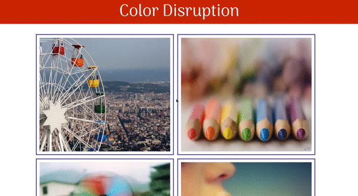
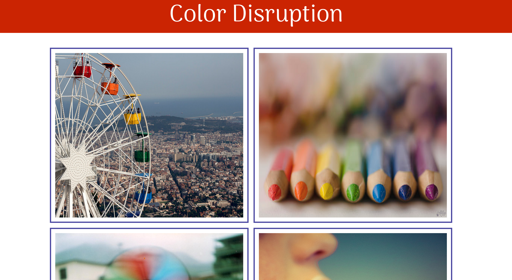
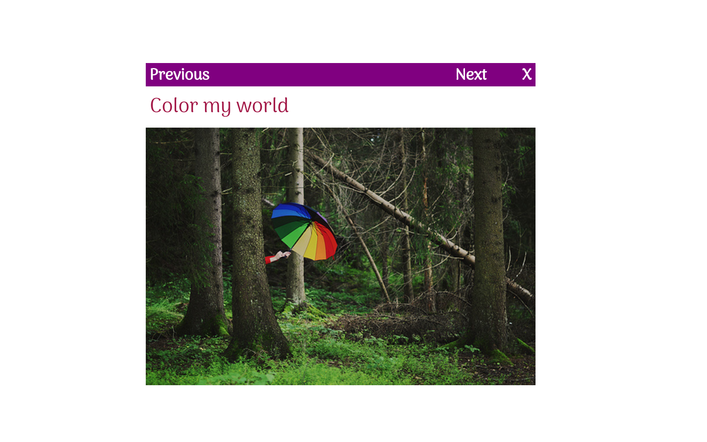

# Color Disruption
"One very important difference between color and monochromatic photography is this: in black and white you suggest; in color you state. Much can be implied by suggestion, but statement demands certainty... absolute certainty." ~ Paul Outerbridge*

### [Deployed Here](https://color-disruption.herokuapp.com/)

A simple and playful gallery of images queried from the Flickr public API and displayed in thumbnail format as well as a navigational lightbox. 

### Tech Stack

Native Javascript & HTML / CSS

(no dependencies nor frameworks)

### The Roadmap

* This is a static web page that shows a grid of photo thumbnails
* I've used the Flickr public API to query photos and their titles
* When a thumbnail is clicked, the photo is displayed in a lightbox view, with the ability to move to the next / previous photos
* The page will run without errors in the latest versions of Chrome, Safari, Firefox and IE
* Update the UI of the page without refreshing; and

### Acknowledgments

I would love to spend time developing tests and adding a search function in order to dynamically change the images. It would also be fun to make the image thumbnails appear in dynamic "Pinterest" style. And of course, adding back elements and desgin for responsiveness.

---

